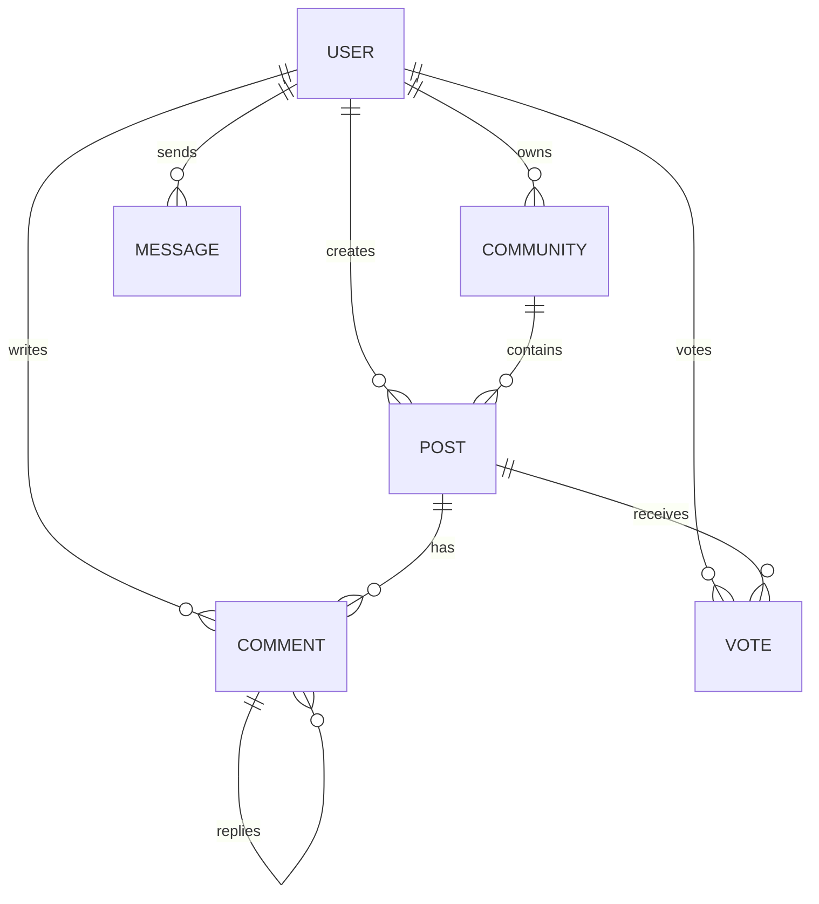

# Reddit Clone 🚀

A full-featured Reddit-style social media platform built with React and Node.js.

🔗 **[Live Demo](https://reddit-clone-iota-taupe.vercel.app/login)**

---

## ✨ Features

- **Authentication** - JWT-based login/signup, secure password hashing
- **User Profiles** - Avatar, banner, bio, karma, follow system
- **Communities** - Create, join, moderate (public & private)
- **Posts** - Text, images, videos with multiple sorting options
- **Comments** - Nested/threaded with replies
- **Voting** - Upvote/downvote on posts and comments
- **Messaging** - Direct messages with read receipts
- **Notifications** - Replies, mentions, follows, upvotes
- **Search** - Find posts, users, and communities
- **AI Summaries** - AI-powered post summarization

---

## 🛠️ Tech Stack

**Frontend:** React 18, Vite, React Router, Axios, CSS  
**Backend:** Node.js, Express.js, MongoDB, Mongoose, JWT  
**Services:** Cloudinary (media), Groq AI (summaries), Vercel (hosting)

---

## 📊 Database Schema



---

## � Quick Start

### Backend
```bash
cd backend/server
npm install
# Create .env with: MONGO_URI, JWT_SECRET, CLOUDINARY_*
npm run dev
```

### Frontend
```bash
cd frontend
npm install
npm run dev
```

**URLs:** Frontend → http://localhost:5173 | API → http://localhost:5000

---

## 📡 API Overview

| Category | Endpoints |
|----------|-----------|
| Auth | `/api/auth/signup`, `/login` |
| Posts | `/api/posts`, `/popular`, `/all` |
| Communities | `/api/communities`, `/trending`, `/explore` |
| Comments | `/api/comments` |
| Users | `/api/users/me`, `/:username` |
| Messages | `/api/messages` |
| Notifications | `/api/notifications` |
| Search | `/api/search?q=` |

--- 
GitHub: [@AbdulrhmanHammouda](https://github.com/AbdulrhmanHammouda)  
Repository: [reddit-clone](https://github.com/AbdulrhmanHammouda/reddit-clone)
